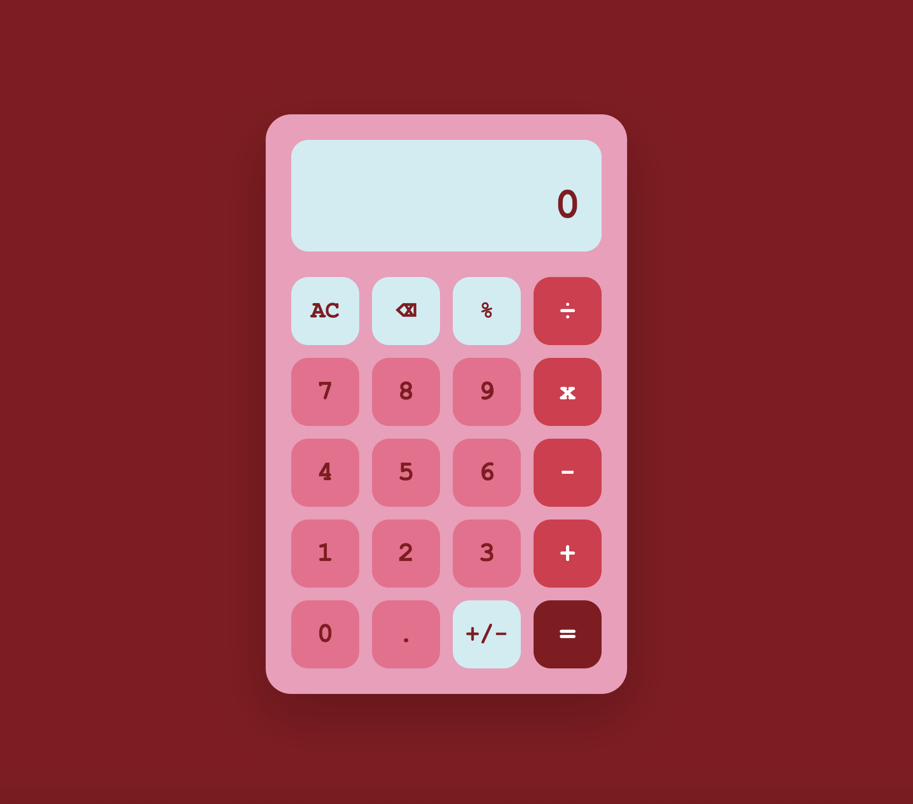

# 🧮 Calculator

A fully functional calculator web application built with JavaScript.  
This project focuses on **state management**, **event handling**, and **building real application logic** without external libraries.

## Live Demo

[View on GitHub Pages](https://inaladevi.github.io/calculator/)

## Features

- Basic arithmetic operations:
  - Addition
  - Subtraction
  - Multiplication
  - Division
- Chained calculations (e.g. `12 + 7 - 1 =`)
- Clear (`AC`) and backspace (`⌫`) functionality
- Percentage (`%`) conversion
- Sign toggle (`+ / -`)
- Decimal input with validation
- Keyboard support:
  - Numbers (`0–9`)
  - Operators (`+ - * /`)
  - Enter (`=`), Backspace, Escape (`AC`)
- Error handling for division by zero
- Rounded results to prevent display overflow
- Calculation history display

## Built With

- HTML5
- CSS3 (Flexbox)
- JavaScript

## Preview

